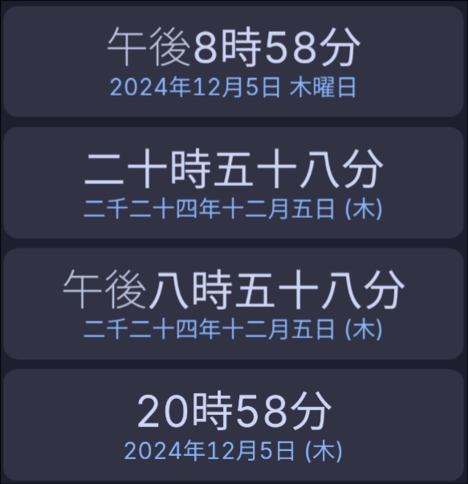

# Kanji Clock Card by [@sopelj](https://www.github.com/sopelj)

[](https://github.com/sopelj/lovelace-kanji-clock-card/releases)
[](LICENSE.md)
[](https://github.com/hacs/integration)


A simple clock widget using Japanese Kanji for time and date



## Options

| Name           | Type    | Requirement  | Description                               | Default |
|----------------|---------|--------------|-------------------------------------------|---------|
| type           | string  | **Required** | `custom:kanji-clock-card`                 |         |
| use_24h        | boolean | **Optional** | Use 24 hour clock                         | `false` |
| invert_date    | boolean | **optional** | Use d日m月Y年 instead of the standard Y年m月d日 | `false` |
| short_weekdays | boolean | **Optional** | Abbreviate weekdays to single kanji       | `true`  |
| kanji_numbers  | boolean | **Optional** | Convert numbers to kanji                  | `false` |

## Installation with Hacs

```yaml
- url: /hacsfiles/lovelace-kanji-clock-card/kanji-clock-card.js
  type: module
```

## Troubleshooting

If it is displaying strangely, please be sure you have a font that can display Kanji. I set it to use 'Sarasa UI J', 'Noto Sans JP', Helvetica then Arial in that order. You can customize the font (or any other style for that matter) with the [Card Mod](https://github.com/thomasloven/lovelace-card-mod) if you wish.

## Development

Clone the repo and run `yarn install` or `npm install`.

You can then run `yarn watch` and run `python -m http.server 8080` to serve the files.
You can then add the development card by adding the following to your lovelace config. (Replacing IP_ADDRESS with the IP of the computer on which you're running the command) *You may need to temporarily allow loading of mixed resources if you are testing on a site with HTTPS*

```yaml
- url: http://IP_ADDRESS:8080/kanji-clock-card.js
  type: module
```

You can then use `yarn lint` and then `yarn build`
